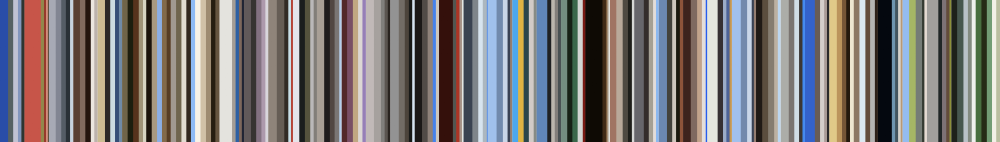
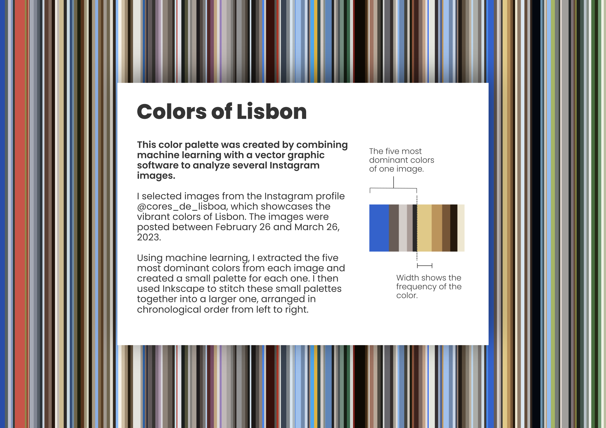

# Palette of the most dominant colors

## The objective
The objective is to create a palette from an image (or series of images) showcasing its (their) five most dominant colors for a cinematography / animation project. 

Here I use a data viz idea of mine as an example. 

## The implementation
The code uses OpenCV to read the images and to create the palettes. The clustering of colors is done by KMeans algorithm from scikit-learn.

## Data viz side project

